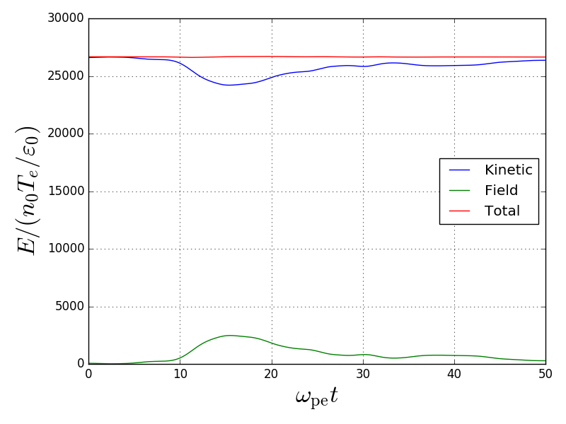

# PiCM

Software for simulation of the dynamics of charged particles with periodic boundary conditions.

## Requirements

You need **Python3** with the following modules:

- NumPy
- tqdm
- click
- Matplotlib

These can be installed via

```bash
pip install numpy tqdm click matplotlib
```

or

```bash
conda install numpy tqdm click matplotlib
```

## Running the program

1. Clone or download the repository.
2. Open a terminal and simply type

```bash
python3 main.py path/to/jsonfile.json
```

Of course, you must know how to build that JSON file and what it contains. This is further explined in the [Wiki](https://github.com/dfrodriguezp/PiCM/wiki) of this repository.

### Example

Let's perform a simulation of a two-stream instability. For this, there is a script called `build_two_stream.py` which creates the sample file as well as the `.json` file. You can set the parameters you prefer. **Note:** for this example, let's pretend you didn't modified it.

1. Open a terminal inside the repository folder.
2. Run the sample script

```bash
python3 build_two_stream.py
```

This will create a folder with the name specified in the `output` variable. Inside that folder you can find both the sample and the `.json` file. The sample file is called `two_stream.dat` and the JSON file `sim_two_stream.json`.

3. Run the simulation

```bash
python3 main.py electrostatic/sim_two_stream.json
```

4. Plot the energy

```bash
python3 plotters/plot_energy.py electrostatic/sim_two_stream.json
```



5. Plot the phase space in the step 150

```bash
python3 plotters/plot_phase_space.py electrostatic/sim_two_stream.json 150
```


